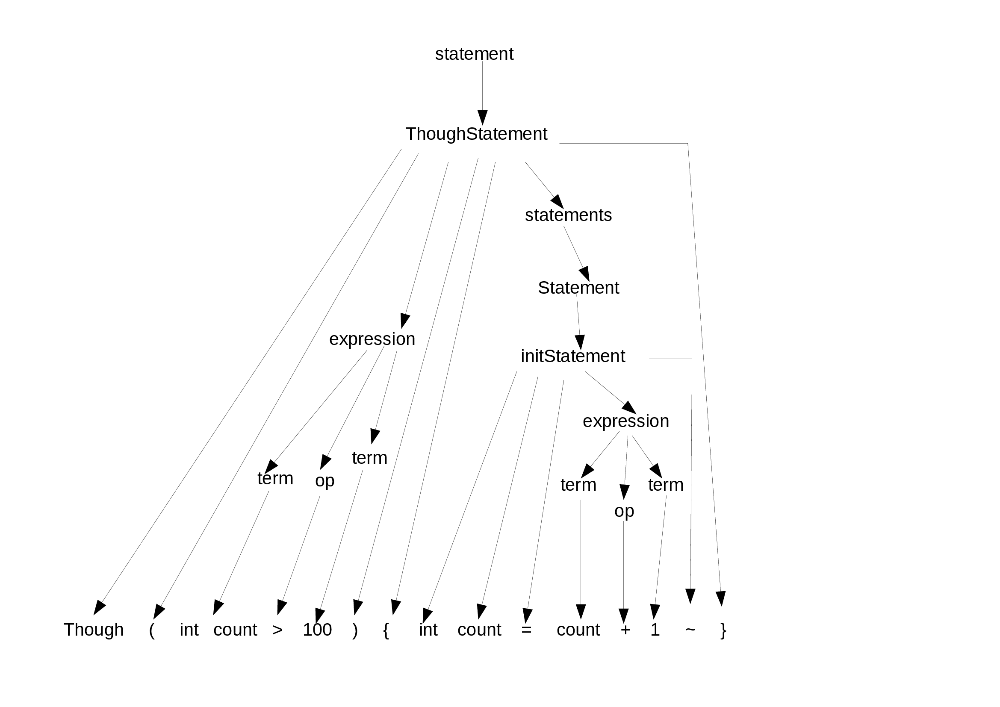

# CompilerConstruction
### Participants 
- Mohammad Hamza
- Osama Maarouf
- Bilal Shafiq
- Ali Hamza
## Language Specifications:
### Lexical Analyzer Implementation using FA:
There are two tpes of states.
##### Final state:
We read a character as lexem and generate a token. Represented by red circles.
##### Retract State:
Reading a character at final state and retract it to initial state. Represented by yellow circles.

#### Explanation:
- States of FA are represented by digits (0-53).
- 0 state is the starting state.
- On Zero state, there are no transitions when whitespaces, newline and tap characters are occure.
- In case of identifier, when special character <b>@</b> read on <b>0 state</b>, it transits to <b>1 state</b> and so on.
- As input is a stream of characters, after reading a token we retract the reading character to initial state.

## Syntax Analyzer:
#### Grammar:
A grammar is a set of rules, describing how tokens can be combined to create valid language constructs. 
##### Example:
Now we see an example of English grammar and validate the sentences written in english language. 

###### Production Rules:
sentence: nounPhrase verbPhrase
nounPhrase: determiner? noun
verbPhrase: verb nounPhrase
noun: 'dog' | ’school' | 'dina' | ’he' | ’she' | 'homework’ | ...
verb: 'went' | 'ate' | ’said' | ...
determiner: 'the' | 'to' | 'my’ | ...

###### Input String:
Dina went to school           <b>valid</b> 
She said                      <b>valid</b> 
The dog ate my homework       <b>valid</b> 

### FOC Grammar (Subset):

statement:===> agerStatement |sinceStatement |thoughStatement|initStatement 
statements:===> statement* 
agerStatement:===> 'ager' '(' expression ')’ '{' statements '}’ 
sinceStatement:===> 'since' '(' expression ')’ '{' statements '}’ 
initStatement:===> '(int|char)' varName '=' expression '~' 
expression:===> term (op term)? 
term    :===> varName | constant 
varName :===> a string not beginning with a special character @ digit|letter and end with @. 
constant:===> a decimal number 
op      :===> '+' | '-' | '=' | '>' | '<' 

##### input Strings:
- int @hamza@ = 100~    <b>valid</b> 
- char @x@= @y@ + 'a'~  <b>valid</b> 
- since(1) output("True")~  } <b>invalid</b> 

### Parsing:
Determining if a given input conforms to a grammar

#### Parse Tree:
##### Example:

