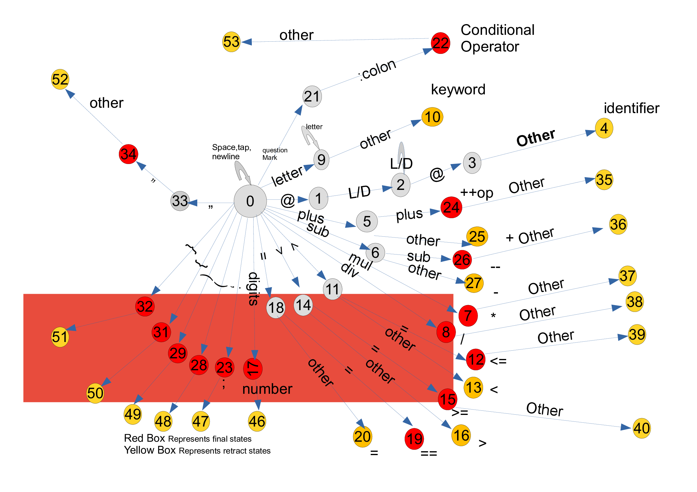

# CompilerConstruction
### Participants 
- Mohammad Hamza
- Osama Maarouf
- Bilal Shafiq
- Ali Hamza
## Language Specifications:
### Lexical Analyzer Implementation using FA:
There are two tpes of states.
##### Final state:
We read a character as lexem and generate a token. Represented by red circles.
##### Retract State:
Reading a character at final state and retract it to initial state. Represented by yellow circles.

#### Explanation:
- States of FA are represented by digits (0-53).
- 0 state is the starting state.
- On Zero state, there are no transitions when whitespaces, newline and tap characters are occure.
- In case of identifier, when special character <b>@</b> read on <b>0 state</b>, it transits to <b>1 state</b> and so on.
- As input is a stream of characters, after reading a token we retract the reading character to initial state.
   
